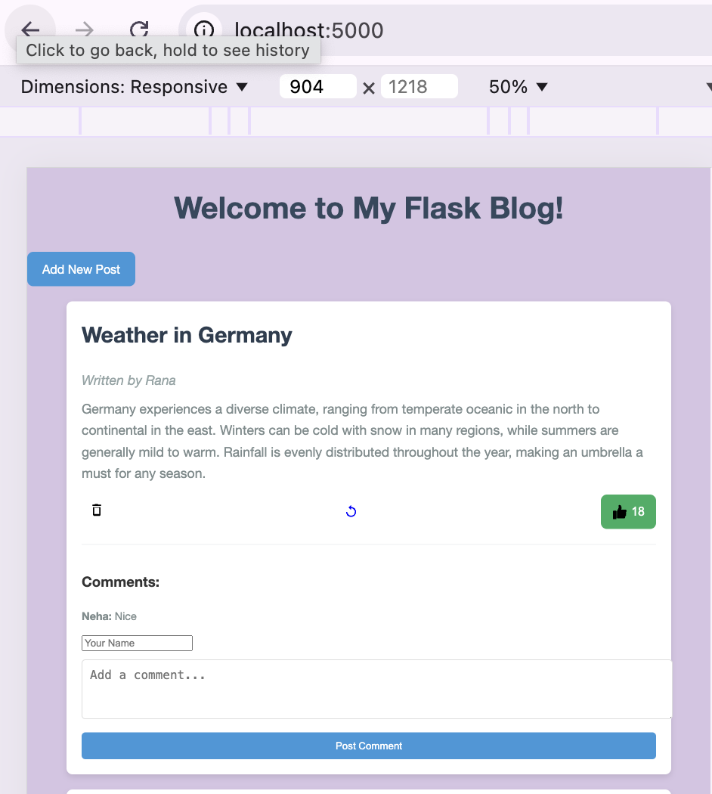

# Flask Blog Application

## Overview

This Flask application is a simple blog platform that allows users to:

- View blog posts.
- Add new blog posts.
- Edit existing blog posts.
- Delete blog posts.
- Like blog posts.
- Comment on blog posts.

## Features

- **Homepage**: Displays a list of all blog posts with options to like, update, or delete each post.
- **Add Post**: A form to create a new blog post.
- **Update Post**: A form to edit an existing blog post.
- **Delete Post**: Removes a blog post from the list.
- **Like Post**: Allows users to like a blog post.
- **Comment on Post**: Users can add comments to a blog post.

## Prerequisites

- Python 3.x
- Flask

## Installation

1. **Clone the Repository**:

    ```bash
    git clone https://github.com/Vrana710/Flask-Blog-App.git
    cd Flask-Blog-App
    ```

2. **Create a Virtual Environment** (optional but recommended):

    ```bash
    python -m venv venv
    source venv/bin/activate  # On Windows use `venv\Scripts\activate`
    ```

3. **Install Dependencies**:

    ```bash
    pip3 install Flask
    ```

4. **Create Directory for Data**:

    Ensure you have a directory named `data` with a `data.json` file. The `data.json` file should be an empty list `[]` initially.

## Running the Application

1. **Start the Flask Application**:

    ```bash
    python3 app.py
    ```

2. **Access the Application**:

    Open a web browser and go to `http://127.0.0.1:5000`.
    or
    http://localhost:5000/

## File Structure

- `app.py`: Main application file containing Flask routes and logic.
- `templates/index.html`: HTML template for displaying posts and comments.
- `templates/add.html`: HTML template for adding a new post.
- `templates/update.html`: HTML template for updating an existing post.
- `static/`: Directory for static files such as CSS, JavaScript, and images.

## API Endpoints

- **GET /**: Displays the homepage with all blog posts.
- **POST /like/<int:post_id>**: Increments the like count for a specific post.
- **GET /add**: Displays the form to add a new post.
- **POST /add**: Submits the form to add a new post.
- **POST /delete/<int:post_id>**: Deletes a specific post.
- **GET /update/<int:post_id>**: Displays the form to update a specific post.
- **POST /update/<int:post_id>**: Submits the form to update a specific post.
- **POST /comment/<int:post_id>**: Adds a comment to a specific post.

## Screenshot for Blog Post Preview
    


## Notes

- Ensure that your `data/data.json` file is properly formatted as a JSON array of posts.
- The application runs in debug mode by default. For production use, disable debug mode in `app.run(debug=False)`.

## Troubleshooting

- **FileNotFoundError**: Ensure that the `data` directory and `data.json` file exist.
- **Permission Errors**: Ensure the application has write permissions for the `data.json` file.

## Contributing

Contributions are welcome! Please open an issue or submit a pull request for any improvements or bug fixes.

## License

This project is licensed under the MIT License - see the [LICENSE](LICENSE) file for details.

## Contact

If you have any questions or suggestions, feel free to contact me at [ranavarsha710@gmail.com](mailto:ranavarsha710@gmail.com).

